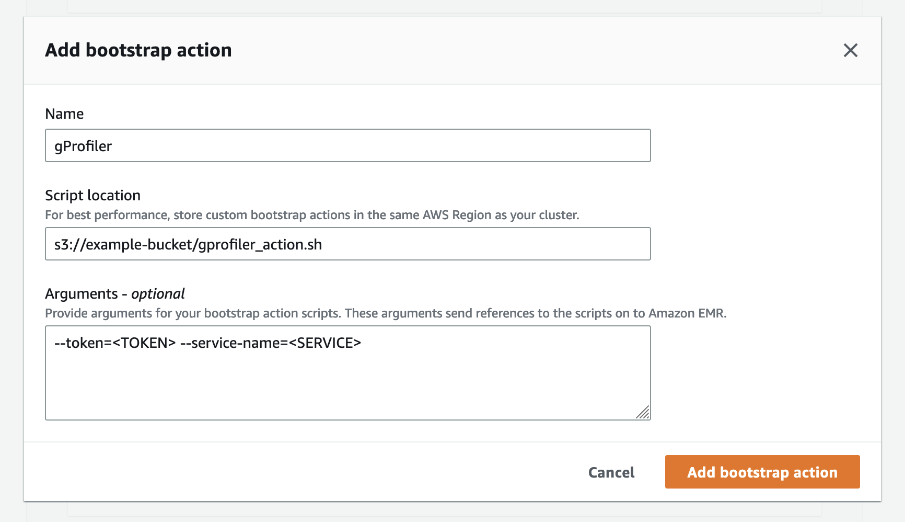
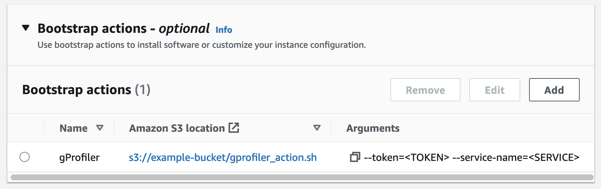

# gProfiler
gProfiler combines multiple sampling profilers to produce unified visualization of
what your CPU is spending time on, displaying stack traces of all processes running on your system
across native programs<sup id="a1">[1](#perf-native)</sup> (includes Golang), Java and Python runtimes, and kernel routines.

gProfiler can upload its results to the [Granulate Performance Studio](https://profiler.granulate.io/), which aggregates the results from different instances over different periods of time and can give you a holistic view of what is happening on your entire cluster.
To upload results, you will have to register and generate a token on the website.

gProfiler runs on Linux (on x86_64 and Aarch64; Aarch64 support is not complete yet and not all runtime profilers are supported, see [architecture support](#architecture-support)).

For installation methods, jump to [run as...](#run-as)


# Configuration & parameters

This section describes the possible options to control gProfiler's behavior.

## Output options

gProfiler can produce output in two ways:

* Create an aggregated, collapsed stack samples file (`profile_<timestamp>.col`)
  and a flamegraph file (`profile_<timestamp>.html`). Two symbolic links (`last_profile.col` and `last_flamegraph.html`) always point to the last output files.

  Use the `--output-dir`/`-o` option to specify the output directory.

  If `--rotating-output` is given, only the last results are kept (available via `last_profle.col` and `last_flamegraph.html`). This can be used to avoid increasing gProfiler's disk usage over time. Useful in conjunction with `--upload-results` (explained ahead) - historical results are available in the Granulate Performance Studio, and the very latest results are available locally.

  `--no-flamegraph` can be given to avoid generation of the `profile_<timestamp>.html` file - only the collapsed stack samples file will be created.

  The output is a collapsed file (`.col`) and its format is described [ahead](#data-format).

* Send the results to the Granulate Performance Studio for viewing online with
  filtering, insights, and more.

  Use the `--upload-results`/`-u` flag. Pass the `--token` option to specify the token
  provided by Granulate Performance Studio, and the `--service-name` option to specify an identifier
  for the collected profiles, as will be viewed in the [Granulate Performance Studio](https://profiler.granulate.io/). *Profiles sent from numerous
  gProfilers using the same service name will be aggregated together.*

Note: both flags can be used simultaneously, in which case gProfiler will create the local files *and* upload
the results.

### Network requirements

When `--upload-results` is used, gProfiler will communicate with `https://profiles.granulate.io` and `https://api.granulate.io`. Make sure those domains are accessible for HTTPS access. If you [require an HTTPS proxy](#Using-HTTP-proxies), make sure the proxy has those domains whitelisted.

## Profiling options
* `--profiling-frequency`: The sampling frequency of the profiling, in *hertz*.
* `--profiling-duration`: The duration of the each profiling session, in *seconds*.

The default profiling frequency is *11 hertz*. Using higher frequency will lead to more accurate results, but will create greater overhead on the profiled system & programs.

For each profiling session (each profiling duration), gProfiler produces outputs (writing local files and/or uploading the results to the Granulate Performance Studio).

### Java profiling options

* `--no-java` or `--java-mode disabled`: Disable profilers for Java.
* `--no-java-async-profiler-buildids`: Disable embedding of buildid+offset in async-profiler native frames (used when debug symbols are unavailable).

### Python profiling options
* `--no-python`: Alias of `--python-mode disabled`.
* `--python-mode`: Controls which profiler is used for Python.
    * `auto` - (default) try with PyPerf (eBPF), fall back to py-spy.
    * `pyperf` - Use PyPerf with no py-spy fallback.
    * `pyspy`/`py-spy` - Use py-spy.
    * `disabled` - Disable profilers for Python.

Profiling using eBPF incurs lower overhead & provides kernel & native stacks.

### PHP profiling options
* `--php-mode phpspy`: Enable PHP profiling with phpspy.
* `--no-php` or `--php-mode disabled`: Disable profilers for PHP.
* `--php-proc-filter`: Process filter (`pgrep`) to select PHP processes for profiling (this is phpspy's `-P` option)

### .NET profiling options
* `--dotnet-mode=dotnet-trace`: Enable .NET profiling with dotnet-trace
* `--no-dotnet` or `--dotnet-mode=disabled`: Disable profilers for .NET.

### Ruby profiling options
* `--no-ruby` or `--ruby-mode disabled`: Disable profilers for Ruby.

### NodeJS profiling options
* `--nodejs-mode`: Controls which profiler is used for NodeJS.
     * `none` - (default) no profiler is used.
     * `perf` - augment the system profiler (`perf`) results with jitdump files generated by NodeJS. This requires running your `node` processes with `--perf-prof` (and for Node >= 10, with `--interpreted-frames-native-stack`). See this [NodeJS page](https://nodejs.org/en/docs/guides/diagnostics-flamegraph/) for more information.
     * `attach-maps` - Generates perf map in runtime, see description ahead.

## attach-maps
In this mode, gProfiler will automatically load a library based on [node-linux-perf module](https://github.com/mmarchini-oss/node-linux-perf) to all target NodeJS processes. This library enables `perf-pid.map` files generation in runtime, without requiring the app to be started with the `--perf-prof` flag, and from that point `perf` is able to symbolicate the compiled JavaScript functions, and we get JavaScript symbols properly.

gProfiler uses the inspector protocol (documented [here](https://nodejs.org/en/docs/guides/debugging-getting-started/#enable-inspector)) to connect to target processes. gProfiler will send `SIGUSR1`, connect to the process and request to it load the library matching its NodeJS version (gProfiler comes built-in with arsenal of libraries for common NodeJS versions). After the library is loaded, gProfiler invokes the `perf-pid.map` generation. This is done to all running NodeJS processes - those running before gProfiler started, and done starting during gProfiler's run. Upon stopping, gProfiler stops the functionality, so processes no longer continue to write those file.  
This requires the entrypoint of application to be CommonJS script. (Doesn't work for ES modules)

### System profiling options

* `--perf-mode`: Controls the global perf strategy. Must be one of the following options:
    * `fp` - Use Frame Pointers for the call graph
    * `dwarf` - Use DWARF for the call graph (adds the `--call-graph dwarf` argument to the `perf` command)
    * `smart` - Run both `fp` and `dwarf`, then choose the result with the highest average of stack frames count, per process. *This is the default.*
    * `disabled` - Avoids running `perf` at all. See [perf-less mode](#perf-less-mode).

## Other options

### Using HTTP proxies
gProfiler uses the Python `requests` package, which works with standard HTTP proxies environment, e.g `https_proxy` or `HTTPS_PROXY` (note - https and not http).
If running gProfiler as an executable and using `sudo`, make sure to run `sudo -E` if you have the environment variable defined (otherwise, `sudo` will forget it). Alternatively, you can run `sudo https_proxy=my-proxy /path/to/gprofiler ...`.
If running gProfiler as a Docker container, make sure to add `-e https_proxy=my-proxy` to the `docker run` command line (the spawned container does not inherit your set of environment variables, you have to pass it manually).

If you still get connection errors, make sure the proxy is indeed used by the profiler - in the `Failed to connect to server` error message you'll see the proxy used by the profiler (under `Proxy used:`).

### Sending logs to server
**By default, gProfiler sends logs to Granulate Performance Studio** (when using `--upload-results`/`-u` flag)
This behavior can be disabled by passing `--dont-send-logs` or the setting environment variable `GPROFILER_DONT_SEND_LOGS=1`.

### Metrics and metadata collection
By default, gProfiler agent sends system metrics (CPU and RAM usage) and metadata to the Performance Studio.
The metadata includes system metadata like the kernel version and CPU count, and cloud metadata like the type of the instance you are running on.
The metrics collection will not be enabled if the `--upload-results`/`-u` flag is not set.
Otherwise, you can disable metrics and metadata by using the following parameters:
* Use `--disable-metrics-collection` to disable metrics collection
* Use `--disable-metadata-collection` to disable metadata collection

### Continuous mode
gProfiler can be run in a continuous mode, profiling periodically, using the `--continuous`/`-c` flag.
Note that when using `--continuous` with `--output-dir`, a new file will be created during *each* sampling interval.
Aggregations are only available when uploading to the Granulate Performance Studio.

### Uploading profiling data from another source
gProfiler can be used to upload external .col file to Granulate Performance Studio by using `upload-file` subcommand.
In case of gProfiler run volume mapping flag must be added. Example for docker usage: `docker run --name granulate-gprofiler -v <path-to-.col>:<path-to-.col> --pid=host --userns=host --privileged  gprofiler:latest upload-file  --token=<token> --service-name="<service>" --file-path <path-to-.col>`
It is also possible to add custom start and end time (in the form of UTC ISO 8601 format time in Python timestamps) to the metadata, so that it will be properly categorized in the Granulate Performance Studio (i.e. `# {"start_time": "2022-10-21T13:51:29.640637","end_time": "2022-10-21T13:54:29.640637", ...`)

# Run as...

This section lists the various execution modes for gProfiler (as a container, as an executable, etc...).

## Running as a Docker container
Run the following to have gProfiler running continuously, uploading to Granulate Performance Studio:
```bash
docker pull granulate/gprofiler:latest
docker run --name granulate-gprofiler -d --restart=on-failure:10 \
    --pid=host --userns=host --privileged \
	granulate/gprofiler:latest -cu --token="<TOKEN>" --service-name="<SERVICE NAME>" [options]
```

## Running as an executable
First, check if gProfiler is already running - run `pgrep gprofiler`. You should not see any output, if you do see any PIDs it means that gProfiler is running and it must be stopped before starting it again (you can stop it with `sudo pkill -TERM gprofiler`).

Run the following to have gprofiler running continuously, in the background, uploading to Granulate Performance Studio:
```bash
wget https://github.com/Granulate/gprofiler/releases/latest/download/gprofiler_$(uname -m) -O gprofiler
sudo chmod +x gprofiler
sudo TMPDIR=/proc/self/cwd sh -c "setsid ./gprofiler -cu --token=\"<TOKEN>\" --service-name=\"<SERVICE NAME>\" [options] > /dev/null 2>&1 &"
sleep 1
pgrep gprofiler # make sure gprofiler has started
```

If the `pgrep` doesn't find any process, try running without `> /dev/null 2>&1 &` so you can inspect the output, and look for errors.

For non-daemon mode runes, you can remove the `setsid` and `> /dev/null 2>&1 &` parts.

The logs can then be viewed in their default location (`/var/log/gprofiler`).

`TMPDIR` is added because gProfiler unpacks executables to `/tmp` by default; this is done by `staticx`. For cases where `/tmp` is marked with `noexec`, we add `TMPDIR=/proc/self/cwd` to have everything unpacked in your current working directory, which is surely executable before gProfiler was started in it.

## Running as systemd service

You can generate a systemd service configuration that [runs gProfiler as an executable](#running-as-an-executable) by running:

``` bash
curl -s https://raw.githubusercontent.com/Granulate/gprofiler/master/deploy/systemd/create_systemd_service.sh | GPROFILER_TOKEN=<TOKEN> GPROFILER_SERVICE=<SERVICE_NAME> bash
```

This script generates `granulate-gprofiler.service` in your working directory, and you can go ahead and install it by:
```
systemctl enable $(pwd)/granulate-gprofiler.service
systemctl start granulate-gprofiler.service
```

## Running on Databricks
For Databricks, the same installation instructions as specified in the [running as an executable](#running-as-an-executable) section can be used (make sure to run them in the initialization script of your node).

Additionally, 2 more flags need to be added to gProfiler's commandline: `--disable-pidns-check --perf-mode=none`. You can add them right after the `--service-name` argument.

* `--disable-pidns-check` is required because gProfiler won't run in the init PID NS.
* `--perf-mode=none` is required because gProfiler will not have permissions to run system-wide `perf`, so we will profile only runtime processes, such as Java. See [perf-less mode](#perf-less-mode) for more information.

## Running as a Kubernetes DaemonSet
See [gprofiler.yaml](deploy/k8s/gprofiler.yaml) for a basic template of a DaemonSet running gProfiler.
Make sure to insert the `GPROFILER_TOKEN` and `GPROFILER_SERVICE` variables in the appropriate location!

### Installing with Helm Chart
Like with the DaemonSet, make sure to insert the `GPROFILER_TOKEN` and `GPROFILER_SERVICE` variables in the appropriate location.
```
cd deploy/k8s/helm-charts
helm install --set gprofiler.token="GPROFILER_TOKEN" --set gprofiler.serviceName="GPROFILER_SERVICE" gprofiler .

# To view additional configuration options you can run:
helm show values .
```

### OpenShift SCCs

If your OpenShift cluster uses [SCCs](https://docs.openshift.com/container-platform/4.12/authentication/managing-security-context-constraints.html), the gProfiler Pods might get an error `FailedCreate` with the reason `unable to validate against any security context constraint`.

If this happens, we must grant the `privileged` SCC to the gProfiler DaemonSet to have the Pods scheduled.

This is done by creating a `Role` that's allowed to use the `privileged` SCC, then granting that `Role` via a `RoleBinding` to a `ServiceAccount` that is used in gProfiler's `DaemonSet`. The 3 objects (`ServiceAccount`, `Role`, `RoleBinding`) can be found in [scc.yaml](deploy/k8s/openshift/scc.yaml). After applying that file, all you need to do is add `serviceAccountName: granulate-service-account` to the gProfiler Pod spec, re-apply the `DaemonSet` and verify that created Pods have the `openshift.io/scc: privileged` annotation, which means they have successfully used the SCC.

## Running as an ECS (Elastic Container Service) Daemon service

### Creating the ECS Task Definition
- Go to ECS, and [create a new task definition](https://console.aws.amazon.com/ecs/home?region=us-east-1#/taskDefinitions/create)
- Choose EC2, and click `Next Step`
- Scroll to the bottom of the page, and click `Configure via JSON` \

- Replace the JSON contents with the contents of the [gprofiler_task_definition.json](deploy/ecs/gprofiler_task_definition.json) file and **Make sure you change the following values**:
  - Replace `<TOKEN>` in the command line with your token you got from the [gProfiler Performance Studio](https://profiler.granulate.io/) site.
  - Replace `<SERVICE NAME>` in the command line with the service name you wish to use.
- **Note** - if you wish to see the logs from the gProfiler service, be sure to follow [AWS's guide](https://docs.aws.amazon.com/AmazonECS/latest/developerguide/using_awslogs.html#create_awslogs_loggroups)
  on how to auto-configure logging, or to set it up manually yourself.
- Click `Save`
- Click `Create`

### Deploying the gProfiler service

* Go to your [ECS Clusters](https://console.aws.amazon.com/ecs/home?region=us-east-1#/clusters) and enter the relevant cluster
* Click on `Services`, and choose `Create`
* Choose the `EC2` launch type and the `granulate-gprofiler` task definition with the latest revision
* Enter a service name
* Choose the `DAEMON` service type
* Click `Next step` until you reach the `Review` page, and then click `Create Service`

## Running on an AWS Fargate service

At the time of this writing, Fargate does not support `DAEMON` tasks (see [this](https://github.com/aws/containers-roadmap/issues/971) tracking issue).

Since Fargate containers don't run with the full set of Linux capabilities, some of the profilers are not supported at all, and others require modifying the Fargate container definition to add the `SYS_PTRACE` capability, which is not included by default.

| Runtime                    | Supported               |
|----------------------------|-------------------------|
| perf (native, Golang, ...) | No                      |
| Java (async-profiler)      | Yes                     |
| Python (py-spy)            | Yes (with `SYS_PTRACE`) |
| Python (PyPerf eBPF)       | No                      |
| Ruby (rbspy)               | Yes (with `SYS_PTRACE`) |
| PHP (phpspy)               | Yes (with `SYS_PTRACE`) |
| NodeJS (perf)              | No                      |
| .NET (dotnet-trace)        | Yes                     |

Furthermore, Fargate does not allow using `"pidMode": "host"` in the task definition (see documentation of `pidMode` [here](https://docs.aws.amazon.com/AmazonECS/latest/APIReference/API_TaskDefinition.html)). Host PID is required for gProfiler to be able to profile processes running in other containers (in case of Fargate, other containers under the same `containerDefinition`).

So in order to deploy gProfiler, we need to modify a container definition to include running gProfiler alongside the actual application. This can be done with the following steps:
1. Modify the `command` & `entryPoint` parameters of your entry in the `containerDefinitions` array. The new command should include downloading of gProfiler & executing it in the background, and `entryPoint` will be `["/bin/bash"]`.

    For example, if your default `command` is `["python", "/path/to/my/app.py"]`, we will now change it to: `["-c", "(wget https://github.com/Granulate/gprofiler/releases/latest/download/gprofiler -O /tmp/gprofiler; chmod +x /tmp/gprofiler; /tmp/gprofiler -cu --token=<TOKEN> --service-name=<SERVICE NAME> --disable-pidns-check --perf-mode none) & python /path/to/my/app.py"]`.

    Make sure to:
    - Replace `<TOKEN>` in the command line with your token you got from the [gProfiler Performance Studio](https://profiler.granulate.io/) site.
    - Replace `<SERVICE NAME>` in the command line with the service name you wish to use.

    This new command will start the downloading of gProfiler in the background, then run your application. Make sure to JSON-escape any characters in your command line! For example, `"` are replaced with `\"`.

    Additionally, we will set `entryPoint` to `["/bin/bash"]`. If you had used `entryPoint` prior to incorporating gProfiler, make sure to use it in the new `command`.

    About `--disable-pidns-check` and `--perf-mode none` - please see the explanation in [running-on-databricks](#running-on-databricks), as it applies here as well.

    gProfiler and its installation process will send the outputs to your container's stdout & stderr. After verifying that everything works, you can append `> /dev/null 2>&1` to the gProfiler command parenthesis (in this example, before the `& python ...`) to prevent it from spamming your container logs.

    This requires your image to have `wget` installed - you can make sure `wget` is installed, or substitute the `wget` command with `curl -SL https://github.com/Granulate/gprofiler/releases/latest/download/gprofiler --output /tmp/gprofiler`, or any other HTTP-downloader you wish.
2. This step is **required** if you wish to profile a runtime environment that requires `SYS_PTRACE` per the table mentioned above, in the beginning of the Fargate section. If you need to add `SYS_PTRACE` for your runtime environment - currently that's for Python, Ruby and PHP - add `linuxParameters` to the container definition (this goes directly in your entry in `containerDefinitinos`):
   ```
   "linuxParameters": {
     "capabilities": {
       "add": [
         "SYS_PTRACE"
       ],
     },
   },
   ```

Alternatively, you can download gProfiler in your `Dockerfile` to avoid having to download it every time in run-time. Then you just need to invoke it upon container start-up.

## Running as a docker-compose service
You can run a gProfiler container with `docker-compose` by using the template file in [docker-compose.yml](deploy/docker-compose/docker-compose.yml).
Start by replacing the `<TOKEN>` and `<SERVICE NAME>` with values in the `command` section -
* `<TOKEN>` should be replaced with your personal token from the [gProfiler Performance Studio](https://profiler.granulate.io/) site (in the [Install Service](https://profiler.granulate.io/installation) section)
* The `<SERVICE NAME>` should be replaced with whatever service name you wish to use

Optionally, you can add more command line arguments to the `command` section. For example, if you wish to use the `py-spy` profiler, you can add `--python-mode pyspy` to the commandline.

**To run it, run the following command:**
  ```bash
  docker-compose -f /path/to/docker-compose.yml up -d
  ```

## Running on Google Dataproc
To run gProfiler on your cluster, you will need to add an [initialization action](https://cloud.google.com/dataproc/docs/concepts/configuring-clusters/init-actions)
that will install the agent on all of your workers when the cluster is created.

First, upload the gProfiler [initialization action script](./deploy/dataproc/gprofiler_initialization_action.sh) file to your Google Cloud Storage bucket -
```shell
gsutil cp gprofiler_initialization_action.sh gs://<YOUR BUCKET>
```
If you don't have a Google Storage bucket, make sure you create one ([documentation](https://cloud.google.com/storage/docs/creating-buckets)).
Then, create your Dataproc cluster with the `--initialization-actions` flag -
```shell
export TOKEN='<TOKEN>' && \
export SERVICE='<SERVICE NAME>' && \
gcloud dataproc clusters create <CLUSTER NAME> \
--initialization-actions gs://<YOUR BUCKET>/gprofiler_initialization_action.sh \
--metadata gprofiler-token="$TOKEN",gprofiler-service="$SERVICE",enable-stdout="1" --region <REGION>
```
**Note** - make sure to replace the placeholders with the appropriate values -
  - Replace `<TOKEN>` in the command line with your token you got from the [gProfiler Performance Studio](https://profiler.granulate.io/installation) site.
  - Replace `<SERVICE NAME>` in the command line with the service name you wish to use.
  - Replace `<YOUR BUCKET>` with the bucket name you have uploaded the gProfiler initialization action script to.
  - Replace `<CLUSTER NAME>` with the cluster name you wish to use
  - Replace `<REGION>` with the region you wish to use

### Debugging problems
If you are experiencing issues with your gProfiler installation (such as no flamegraphs available in the [Performance Studio](https://profiler.granulate.io)
after waiting for more than 1 hour) you can look at gProfiler's logs and see if there are any errors. \
To see gProfiler's logs, you must enable its output by providing `enable-stdout="1"` in the cluster metadata when creating the Dataproc cluster. You can use the example above.
Wait at least 10 minutes after creating your cluster, and then you can SSH into one of your cluster instances via either Dataproc's web interface or the command line.
After connecting to your instance, run the following command:
```shell
tail -f /var/log/dataproc-initialization-script-0.log
```
If you have more than one initialization script, try running the command with an increasing number instead of `0` in the command find the appropriate gProfiler log file.

### Disabling gProfiler stdout output
By default, gProfiler's output is written to the Dataproc initialization script output file (`/var/log/dataproc-initialization-script-{Incrementing number}.log`).
If you wish to disable this behaviour, change the `enable-stdout` metadata variable value to "0" (the default is "1").

## Running on AWS EMR
To run gProfiler on your AWS EMR cluster, add a bootstrap action that will launch gProfiler on each
node when the cluster is provisioned. You will need to provide the token and service name as described below.

1. Upload the [gProfiler bootstrap action file](./deploy/emr/gprofiler_action.sh) to an S3 bucket:

   ```sh
   aws s3 cp gprofiler_action.sh s3://<BUCKET>/gprofiler_action.sh
   ```

2. Add the bootstrap action when creating the cluster. You can do this with [the AWS Console or with the AWS CLI](https://docs.aws.amazon.com/emr/latest/ManagementGuide/emr-plan-bootstrap.html?icmpid=docs_emr_help_panel_cluster-bootstrap#custom-bootstrap):

   In the steps below, make sure to:
     - Replace `<BUCKET>` with the bucket where `gprofiler_action.sh` was uploaded.
     - Replace `<TOKEN>` with the token you got from the [gProfiler Performance Studio](https://profiler.granulate.io/installation) site.
     - Replace `<SERVICE>` with the service name you wish to use.

   With AWS CLI:
     ```sh
     aws emr create-cluster --name "My cluster" ... --bootstrap-actions Path="s3://<BUCKET>/gprofiler_action.sh",Args="[--token=<TOKEN>,--service-name=<SERVICE>]"
     ```

   With new AWS Console:
     - Create a new cluster.
     - Under **Bootstrap actions**, choose **Add**, and fill in the fields:
       - **Name**: gProfiler
       - **Script location**: `s3://<BUCKET>/gprofiler_action.sh`
       - **Arguments**: `--token=<TOKEN> --service-name=<SERVICE>`
       - Example: 
     - Final result should look similar to this: 

## Running via an Ansible playbook
Download the [playbook](./deploy/ansible/gprofiler_playbook.yml) and run it this way:
```
ansible-playbook -i ... gprofiler_playbook.yml --extra-vars "gprofiler_token='<TOKEN>'" --extra-vars "gprofiler_service='<SERVICE NAME>'"
```

**Note** - the playbook defaults to `hosts: all`, make sure to modify the pattern to your liking before running.

The playbook defines 2 more variables:
* `gprofiler_path` - path to download gProfiler to, `/tmp/gprofiler` by default.
* `gprofiler_args` - additional arguments to pass to gProfiler, empty by default. You can use it to pass, for example, `'--profiling-frequency 15'` to change the frequency.

## Running from source
gProfiler requires Python 3.8+ to run.

```bash
pip3 install -r requirements.txt
./scripts/copy_resources_from_image.sh
```

Then, run the following **as root**:
```bash
python3 -m gprofiler [options]
```

# Theory of operation
gProfiler invokes `perf` in system wide mode, collecting profiling data for all running processes.
Alongside `perf`, gProfiler invokes runtime-specific profilers for processes based on these environments:
* Java runtimes (version 7+) based on the HotSpot JVM, including the Oracle JDK and other builds of OpenJDK like AdoptOpenJDK and Azul Zulu.
  * Uses async-profiler.
* The CPython interpreter, versions 2.7 and 3.5-3.10.
  * eBPF profiling (based on PyPerf) requires Linux 4.14 or higher; see [Python profiling options](#python-profiling-options) for more info.
  * If eBPF is not available for whatever reason, py-spy is used.
* PHP (Zend Engine), versions 7.0-8.0.
  * Uses [Granulate's fork](https://github.com/Granulate/phpspy/) of the phpspy project.
* Ruby versions (versions 1.9.1 to 3.0.1)
  * Uses [Granulate's fork](https://github.com/Granulate/rbspy) of the [rbspy](https://github.com/rbspy/rbspy) profiler.
* NodeJS (version >= 10 for functioning `--perf-prof`):
  * Uses `perf inject --jit` and NodeJS's ability to generate jitdump files. See [NodeJS profiling options](#nodejs-profiling-options).
  * Can also generate perf maps at runtime - see [attach-maps](#attach-maps) option.
* .NET runtime
  * Uses dotnet-trace.

The runtime-specific profilers produce stack traces that include runtime information (i.e, stacks of Java/Python functions), unlike `perf` which produces native stacks of the JVM / CPython interpreter.
The runtime stacks are then merged into the data collected by `perf`, substituting the *native* stacks `perf` has collected for those processes.

## Architecture support

| Runtime                    | x86_64                            | Aarch64                           |
|----------------------------|-----------------------------------|-----------------------------------|
| perf (native, Golang, ...) | :heavy_check_mark:                | :heavy_check_mark:                |
| Java (async-profiler)      | :heavy_check_mark:                | :heavy_check_mark:                |
| Python (py-spy)            | :heavy_check_mark:                | :heavy_check_mark:                |
| Python (PyPerf eBPF)       | :heavy_check_mark:                | :x:                               |
| Ruby (rbspy)               | :heavy_check_mark:                | :heavy_check_mark:                |
| PHP (phpspy)               | :heavy_check_mark:                | :heavy_check_mark: (experimental) |
| NodeJS (perf)              | :heavy_check_mark:                | :heavy_check_mark:                |
| .NET (dotnet-trace)        | :heavy_check_mark: (experimental) | :heavy_check_mark: (experimental) |

## perf-less mode

It is possible to run gProfiler without using `perf` - this is useful where `perf` can't be used, for whatever reason (e.g permissions). This mode is enabled by `--perf-mode disabled`.

In this mode, gProfiler uses runtime-specific profilers only, and their results are concatenated (instead of scaled into the results collected by `perf`). This means that, although the results from different profilers are viewed on the same graph, they are not necessarily of the same scale: so you can compare the samples count of Java to Java, but not Java to Python.

## Data format

This section describes the data format output by the profiler. Some of it is relevant to the local output files (`.col`) files and some of it is relevant both for the local output files and for the data as viewable in the Performance Studio.

### Collapsed files

The collapsed file (`.col`) is a [collapsed/folded stacks file](https://github.com/brendangregg/FlameGraph#2-fold-stacks) that'll be written locally per profiling session if gProfiler was invoked with the `-o` switch.  
The file begins with a "comment line", starting with `#`, which contains a JSON of metadata about the profile. Following lines are *stacks* - they consist of *frames* separated by `;`, with the ending of each line being a space followed by a number - how many *samples* were collected with this stack.  
The first frame of each stack is an index in the application metadata array (which is part of the aforementioned JSON), for the process recorded in this sample.  
The second frame is the container name that the process recorded in this sample runs in; if the process is not running in a container, this frame will be empty.  
The third frame is the process name - essentially the process `comm` in Linux.  
All following frames are the output of the profiler which emitted the sample (usually - function names). Frames are described in [frame format](#frame-format).

### Application identifiers

An application identifier ("appid" for short) is an optional frame that follows the process name frame. This frame has the format `appid: ...`. Per profiled process, gProfiler attempts to extract its appid, and "inject" it into the profile collected for that process - the purpose is to give the user more context about the source application of the proceeding frames.  
For example, a Python application invoked as `cd /path/to/my/app && python myscript.py` will have the following appid: `appid: python: myscript.py (/path/to/my/app/myscript.py)` - this appid tells us it's a Python application running `myscript.py` and gives in parenthesis the absolute path of the executed script.

gProfiler currently supports appids for Java, Python, NodeJS & Ruby, with each runtime having possibly more than one implementation (e.g in Python, the appid of a Gunicorn-based application is decided differently, because the app doesn't specify a "Python script" to invoke, but instead specifies a WSGI application spec). You can see the various implementations in [application_identifiers.py](./gprofiler/metadata/application_identifiers.py)

Collection of appids is enabled by default and can be disabled with the `--disable-application-identifiers` switch.

### Frame format

Each frame represents a function as identified by gProfiler. Since gProfiler aggregated frames collected by different profilers, the frame format differs depending on which profiler collected it, and from which runtime it originates (e.g Python vs Java).
Additionally, each frame has a suffix which designates the profiler it originated from and the logical "source" for the frame - is it Java code? Kernel code? Native library code?

| Runtime                               | Frame Format                                                                                                                                                                            | Suffix                                                                                                   |
|---------------------------------------|-----------------------------------------------------------------------------------------------------------------------------------------------------------------------------------------|----------------------------------------------------------------------------------------------------------|
| Native - C, C++, Rust (perf)          | Symbol name                                                                                                                                                                             | None                                                                                                     |
| Golang (perf)                         | Symbol name                                                                                                                                                                             | None                                                                                                     |
| Java (async-profiler)                 | Method FQN + signature, per [async-profiler's `-g` switch](https://github.com/jvm-profiling-tools/async-profiler#profiler-options). `;`s in the method signature are replaced with `\|` | [Per asnyc-profiler `-a` switch](https://github.com/jvm-profiling-tools/async-profiler#profiler-options) |
| Native (async-profiler)               | Symbol name                                                                                                                                                                             | None                                                                                                     |
| Python (PyPerf)                       | `package.(instance class if it's a method/classmethod).function_name (filename.py:line_number)`                                                                                         | `_[p]`                                                                                                   |
| Native (PyPerf)                       | Symbol name                                                                                                                                                                             | `_[pn]`                                                                                                  |
| Python (py-spy)                       | `package.function_name (filename.py:line_number)`                                                                                                                                       | `_[p]`                                                                                                   |
| NodeJS (perf)                         | Per NodeJS                                                                                                                                                                              | None                                                                                                     |
| Ruby (rbspy)                          | Per rbspy                                                                                                                                                                               | `_[rb]`                                                                                                  |
| PHP (phpspy)                          | Per phpspy                                                                                                                                                                              | `_[php]`                                                                                                 |
| .NET (dotnet-trace)                   | Per dotnet-trace                                                                                                                                                                        | `_[net]`                                                                                                 |
| Kernel (perf, async-profiler, PyPerf) | Function name                                                                                                                                                                           | `_[k]`                                                                                                   |

# Building

Please refer to the [building](./CONTRIBUTING.md#building) section.

# Contribute
We welcome all feedback and suggestion through Github Issues:
* [Submit bugs and feature requests](https://github.com/granulate/gprofiler/issues)
* Upvote [popular feature requests](https://github.com/granulate/gprofiler/issues?q=is%3Aopen+is%3Aissue+label%3Aenhancement+sort%3Areactions-%2B1-desc+)

## Releasing a new version
1. Update `__version__` in `__init__.py`.
2. Create a tag with the same version (after merging the `__version__` update) and push it.

We recommend going through our [contribution guide](./CONTRIBUTING.md) for more details.

# Credits
* [async-profiler](https://github.com/jvm-profiling-tools/async-profiler) by [Andrei Pangin](https://github.com/apangin). See [our fork](https://github.com/Granulate/async-profiler).
* [py-spy](https://github.com/benfred/py-spy) by [Ben Frederickson](https://github.com/benfred). See [our fork](https://github.com/Granulate/py-spy).
* [bcc](https://github.com/iovisor/bcc) (for PyPerf) by the IO Visor project. See [our fork](https://github.com/Granulate/bcc).
* [phpspy](https://github.com/adsr/phpspy) by [Adam Saponara](https://github.com/adsr). See [our fork](https://github.com/Granulate/phpspy).
* [rbspy](https://github.com/rbspy/rbspy) by the rbspy project. See [our fork](https://github.com/Granulate/rbspy).
* [dotnet-trace](https://github.com/dotnet/diagnostics/tree/main/src/Tools/dotnet-trace)
* [Datadog Agent Integrations](https://github.com/DataDog/integrations-core) for the Spark, YARN metrics

# Footnotes

<a name="perf-native">1</a>: To profile native programs that were compiled without frame pointers, make sure you use the `--perf-mode smart` (which is the default). Read more about it in the [Profiling options](#profiling-options) section[↩](#a1)
